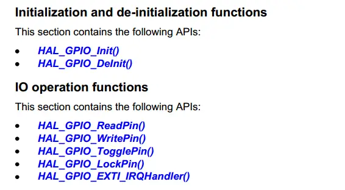
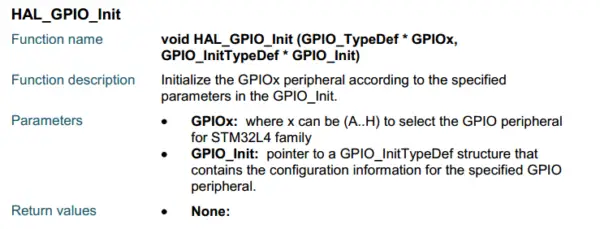

# STM32 HAL Library Drivers

As mentioned above, the STM32Cube Hardware Abstraction Layer (HAL) is an embedded software STM32 abstraction layer that ensures maximum portability across the STM32 microcontroller. The HAL is available to all hardware peripherals and hides the complexity of the MCU and peripherals from the end user. 

Compared to the STM32 HAL library, the Low-Layer APIs (LL) is much closer to the hardware, providing a fast, lightweight, expert-oriented layer. It's only available for a number of peripherals. 

However, both are complementary and cover aa wide range of application requirements. Its source code is developed in Strict ANSI-C, which makes it independent from the development tools. It is fully documented and **MISRA-C 2004 compliant**. 

## STM32 HAL Driver Examples
The STM32 HAL Drivers provide functions for all hardware peripherals in the STM32 microcontrollers, including GPIO, Timer, ADC, USART, I2C, USB, DAC, Comparators, etc.

Here is an example for the HAL GPIO APIs:

The CubeMX software allows you to graphically configure these peripherals and generate the initialization C code.