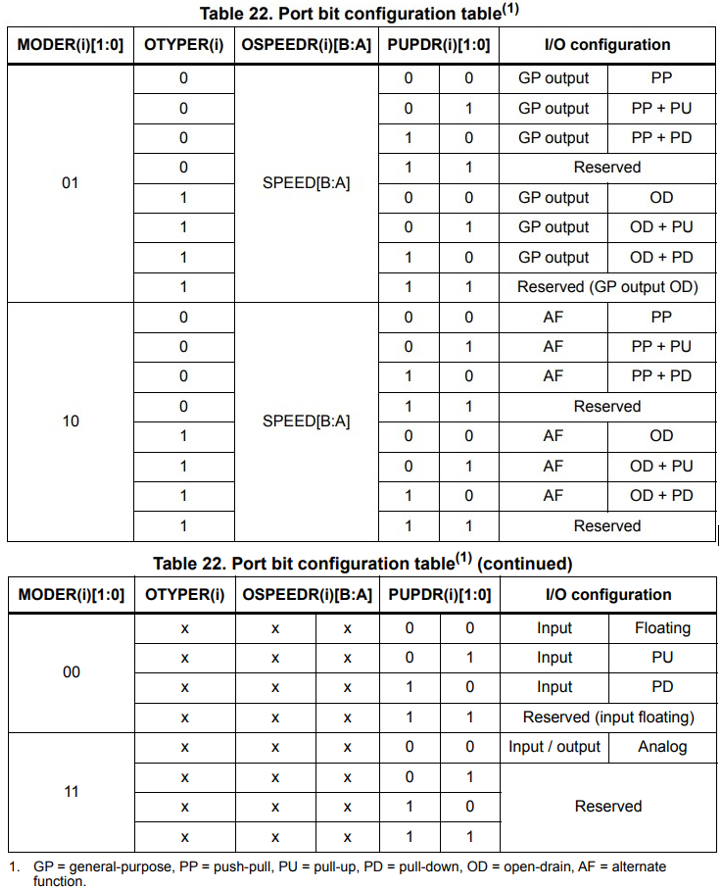
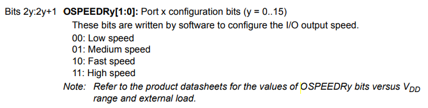

# STM32 GPIO Tutorial

## General-purpose I/O ports
+ 32-bit Configuration registers *4 
    - GPIOx_MODER
    - GPIOx_OTYPER 
    - GPIOx_OSPEEDR
    - GPIOx_PUPDR
+ 32-bit data registers *2 
    - GPIOx_IDR 
    - GPIOx_ODR
+ 32-bit set/reset register (GPIOx_BSRR): is to allow **atomic** read/modify accessess to any of the GPIO registers. 
+ 32-bit locking register (GPIOx_LCKR)
+ 32-bit alternate function selection register:
    - GPIOx_AFRH 
    - GPIOx_AFRL

Note: 
    The port I/O port registers have to be accessed as 32-bit words, half-words or bytes.

    all GPIO pins are not 5v tolerant by default until you find in the datashed that a specific pin is 5v tolorent. The pins are mostly 3.3v and can be damaged when hooked up to 5v digital input lines. 

The differents mode:
Diese Modi beziehen sich auf die Konfiguration von General Purpose Input/Output (GPIO)-Pins auf Mikrocontrollern oder anderen programmierbaren Bausteinen. Hier ist eine Erklärung für jeden Modus:

1. **Input Floating (Eingang schwebend):**
   - Der Pin ist als Eingang konfiguriert.
   - Es gibt keine interne Pull-up- oder Pull-down-Widerstände aktiviert.
   - Der Eingang ist nicht mit einer festen elektrischen Referenz verbunden und kann daher durch externe Einflüsse (z. B. Rauschen) beeinflusst werden.

2. **Input Pull-up (Eingang mit Pull-up-Widerstand):**
   - Der Pin ist als Eingang konfiguriert.
   - Ein interner Pull-up-Widerstand ist aktiviert, der den Eingang auf HIGH (logisch 1) zieht.
   - Dies ist nützlich, wenn der Pin mit einem externen Schalter verbunden ist, der auf GND (Ground) schaltet.

3. **Input Pull-down (Eingang mit Pull-down-Widerstand):**
   - Der Pin ist als Eingang konfiguriert.
   - Ein interner Pull-down-Widerstand ist aktiviert, der den Eingang auf LOW (logisch 0) zieht.
   - Dies ist nützlich, wenn der Pin mit einem externen Schalter verbunden ist, der auf VCC (Versorgungsspannung) schaltet.

4. **Analog:**
   - Der Pin ist für analoge Signale konfiguriert.
   - Kann für die Messung von kontinuierlichen analogen Spannungen verwendet werden, im Gegensatz zu diskreten digitalen Werten.

5. **Output Open-Drain mit Pull-up oder Pull-down-Fähigkeit:**
   - Der Pin ist als Ausgang konfiguriert.
   - Der Ausgang kann auf GND (Open-Drain) ziehen.
   - Ein interner Pull-up- oder Pull-down-Widerstand kann aktiviert werden, um den Zustand des Ausgangs zu stabilisieren, wenn der Ausgang nicht aktiv ist.

6. **Output Push-Pull mit Pull-up oder Pull-down-Fähigkeit:**
   - Der Pin ist als Ausgang konfiguriert.
   - Der Ausgang kann sowohl auf VCC (Push) als auch auf GND (Pull) ziehen.
   - Ein interner Pull-up- oder Pull-down-Widerstand kann aktiviert werden, um den Zustand des Ausgangs zu stabilisieren, wenn der Ausgang nicht aktiv ist.

7. **Alternate Function Push-Pull mit Pull-up oder Pull-down-Fähigkeit:**
   - Der Pin wird für eine alternative Funktion (z. B. UART, SPI, PWM) konfiguriert.
   - Der Ausgangsmodus ist push-pull, und es können interne Pull-up- oder Pull-down-Widerstände aktiviert werden.

8. **Alternate Function Open-Drain mit Pull-up oder Pull-down-Fähigkeit:**
   - Der Pin wird für eine alternative Funktion konfiguriert.
   - Der Ausgangsmodus ist Open-Drain, und es können interne Pull-up- oder Pull-down-Widerstände aktiviert werden.
   - Dies kann in bestimmten Kommunikationsprotokollen nützlich sein, bei denen mehrere Geräte denselben Bus teilen und ein Gerät den Bus auf GND ziehen kann, während andere Geräte ihn auf HIGH setzen.

# STM32 GPIO Speed 

**For Input Mode**

The APB2 Bus sped determines the input sampling speed for the GPIO pins, because the data present on the I/O pin is sampled into the Input Data Register every APB2 clock cycle. 

**For Output Mode**
The pin speed mode has to be configured by programming the respective bits in the configuration registers. 

## GPIO Bit Atomic Operations
The functionality of the bit set reset register (GPIOx_BSRR) in the context of a microcontroller's general-purpose input/output (GPIO) operations. Here's the breakdown:

1. **Register Description:**
   - GPIOx_BSRR is a 32-bit register.
   - It is used to set and reset individual bits in the output data register (GPIOx_ODR).
   - GPIOx_BSRR is twice the size of GPIOx_ODR.

2. **Control Bits Correspondence:**
   - Each bit in GPIOx_ODR corresponds to two control bits in GPIOx_BSRR: BSRR(i) and BSRR(i+SIZE).
   - Setting BSRR(i) to 1 sets the corresponding ODR(i) bit.
   - Setting BSRR(i+SIZE) to 1 resets the corresponding ODR(i) bit.

3. **Behavior of Writing to the Register:**
   - Writing a bit to 0 in GPIOx_BSRR has no effect on the corresponding bit in GPIOx_ODR.
   - If there's an attempt to both set and reset a bit in GPIOx_BSRR, the set action takes priority.

4. **One-shot Effect and Atomic Bitwise Handling:**
   - Using GPIOx_BSRR to change GPIOx_ODR values is a "one-shot" effect, meaning it doesn't lock the GPIOx_ODR bits.
   - The GPIOx_ODR bits can always be accessed directly.
   - GPIOx_BSRR facilitates atomic bitwise handling, ensuring that operations are completed without interruption.

5. **Interrupt Handling:**
   - There's no need to disable interrupts when programming GPIOx_ODR at the bit level.
   - Modifying one or more bits in a single atomic AHB1 write access is possible, ensuring that the operation is uninterrupted.

In summary, GPIOx_BSRR provides a mechanism for efficiently setting and resetting individual bits in the GPIOx_ODR register, with a focus on atomic operations and maintaining control over the priority of set and reset actions.

## External interrupt/wakeup lines
All ports have external interrupt capability. To use external interrupt lines, the port must be configured in input mode. See later

## STM32 GPIO External Interupts

All ports have external interrupt capability. To use external interrupt lines, the port must be configured in input mode. 

## STM32 GPIO Locking Mechanism 
The locking mechanism allows the IO configuration to be frozen. When the LOCK sequence has been applied on a port bit, it is no longer possible to modify the value of the port bit until the next reset. 

## Use a STM32 GPIO

1) enable the clock for GPIO you want to use. 
2) configure the GPIO mode.

