# STM32 GPIO Example HAL Write_Pin & Toggle Pin (Digital Output)

Goal: 
+ Configure GPIO Output Pin Within the STM32CubeMX Tool
+ Use HAL_GPIO_Write() function to change an output pin state
+ Use HAL_GPIO_TogglePin() function to toggle the state of a GPIO pin
+ Use The HAL_Delay() & Know How It Works

## STM32 GPIO Example (CubeMX Configurations)

* Step #1 

Open STM32CubeMX, create a new project, and select the NUCLEO-F446RE target microcontroller. After selecting the right Board click on "Yes" to install the peripherals with thier defaut Mode.

According to original Tutorial: This example project should work flawlessly on any STM32 target microcontroller, you just need to select the target MCU that matches your hardware board.

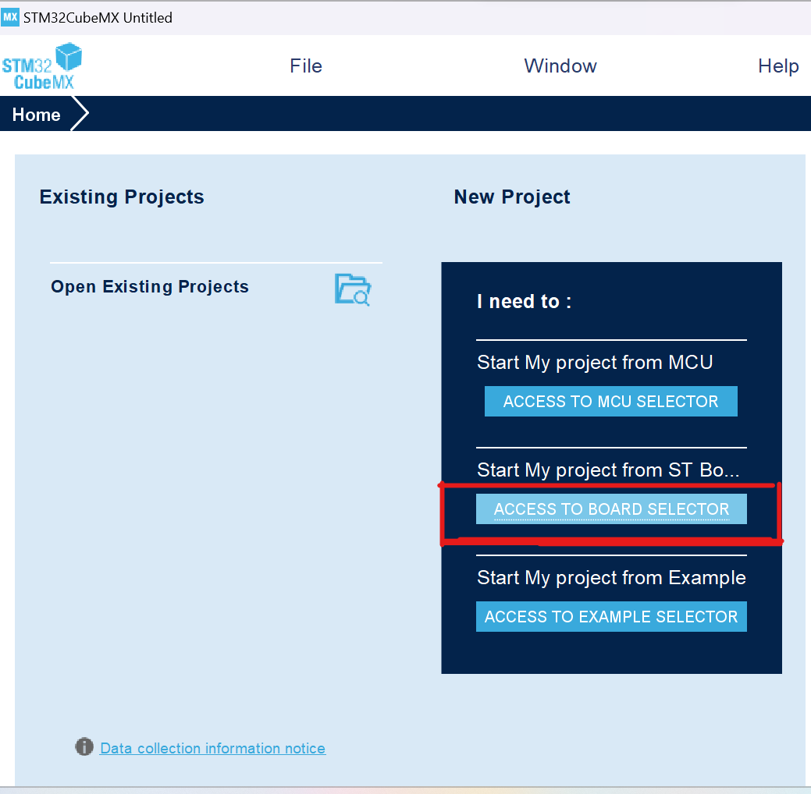
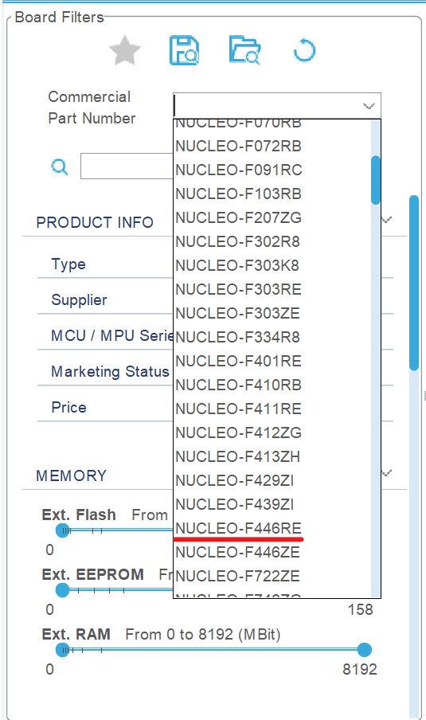
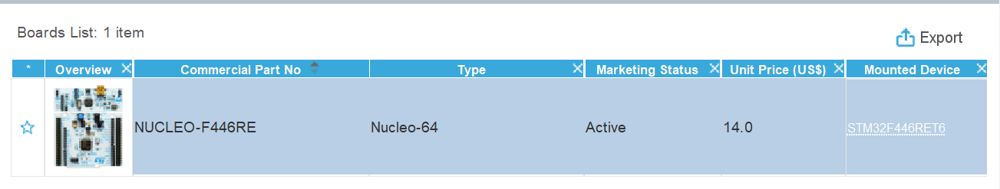
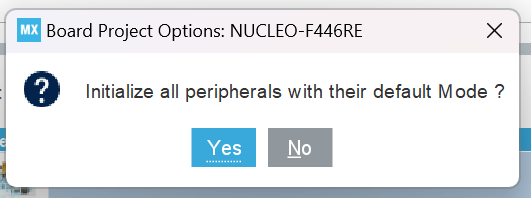

* Step #2 

Go to the RCC clock configuration page and enable the **HSE external crystal oscillator[^1]** input.

[^1]: High-speed external oscillator (HSE) crystall has the advantage of producing a very accurate main clock. Using a 25 MHz oscillator is a good choice for an accurate USB OTG high-speed peripheral, I2S and SAI. (Page 120 in manual rm0390-stm32f446xx-advanced-armbased-32bit-mcus-stmicroelectronics)

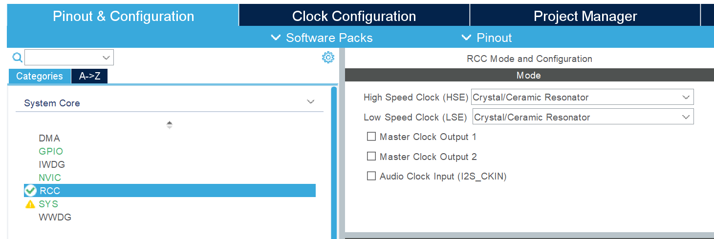

Click on the **PA8** GPIO pin in the **“Pinout View”** and select it to be in GPIO_Output mode. Note: you can use any other pin you want instead.
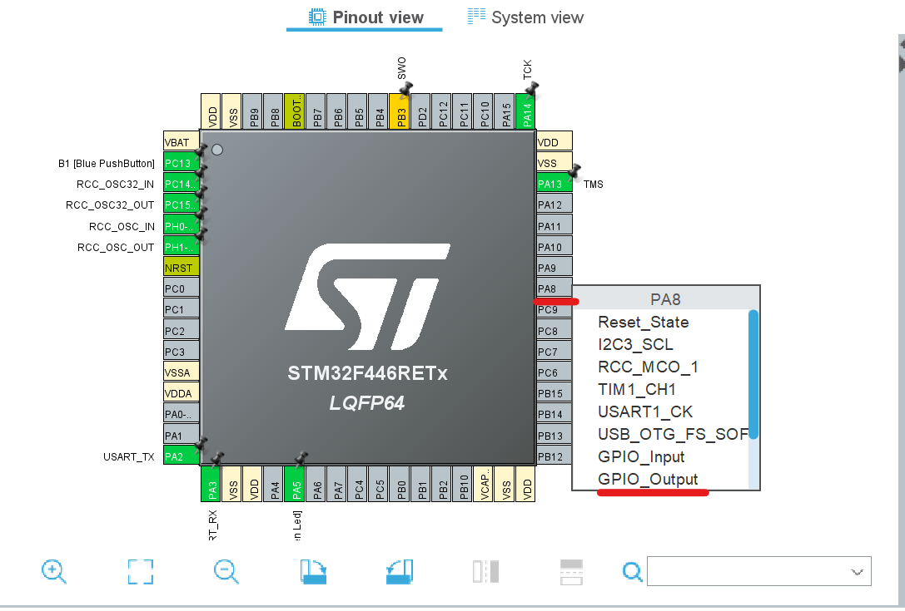

* Step #3

Go to the clock configurations page, and select the **HSE** as a clock source, **PLL** output, and type in **72MHz** for the desired output system frequency. Hit the **“Enter”** key, and let the application solve for the required PLL dividers/multipliers to achieve the desired clock rate.

The reason behind this: using the external onboard oscillator on the Nucleo board provides a more accurate and stable clock.
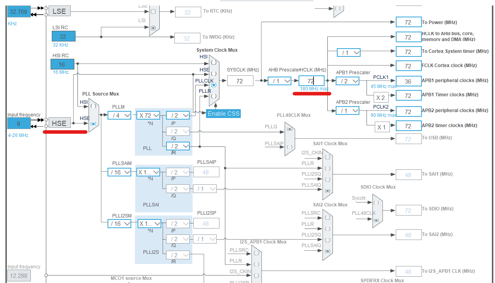

*Step #4 

Finally, go to the Project Manager, give your project a name, select the toolchain/IDE to be STM32CubeIDE, and click on the Generate Code button.

The STM32CubeMX tool will generate the initialization code & the project main files and it’ll prompt you to open the project in STM32CubeIDE. Select, open project, and let’s move to the next step.
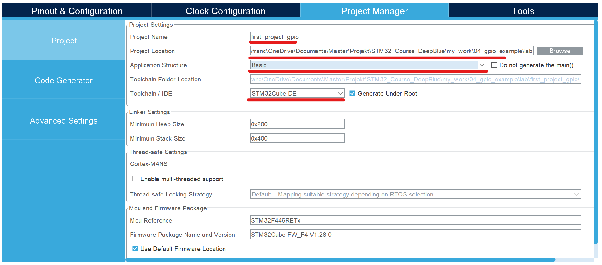
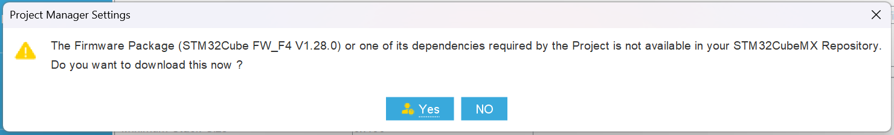
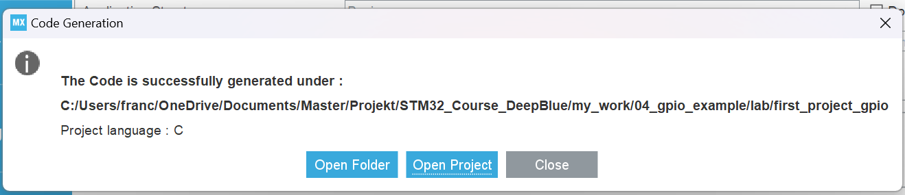
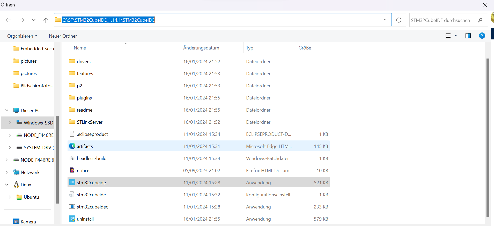
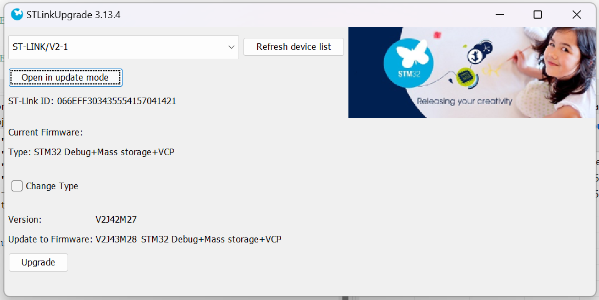

Now click on **OK** to open the project in STM32CubeIDE

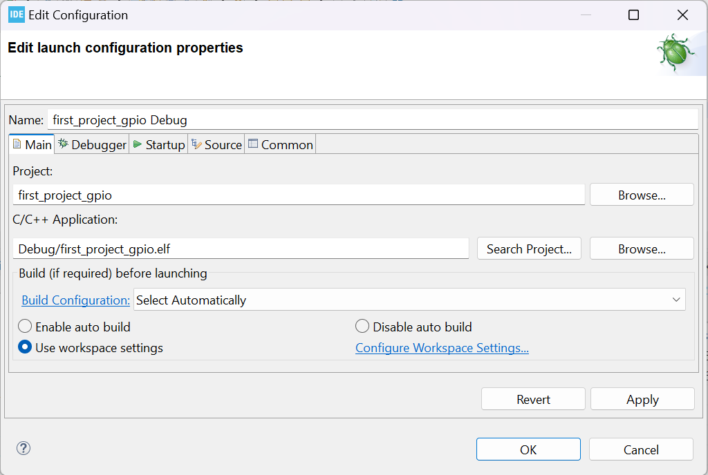

* Step #5 
Copy the following code into your main.c file replacing the auto-generated code from the beginning of the fill till the main function. You should leave everything else under the main() function in the main.c file as is.

**STM32 GPIO Example HAL Write_Pin & Toggle_Pin**
```
#include "main.h"
/* Private function prototypes -----------------------------------------------*/
void SystemClock_Config(void);
static void MX_GPIO_Init(void);


/**
  * @brief  The application entry point.
  * @retval int
  */
int main(void)
{
  /* Reset of all peripherals, Initializes the Flash interface and the Systick. */
  HAL_Init();

  /* Configure the system clock */
  SystemClock_Config();

  /* Initialize all configured peripherals */
  MX_GPIO_Init();

  /* Infinite loop */
  /* USER CODE BEGIN WHILE */
  while (1)
  {
    /* USER CODE END WHILE */
	  HAL_GPIO_TogglePin(GPIOA, GPIO_PIN_8);
	  HAL_Delay(100);
  }
  /* USER CODE END  */
}

/**
  * @brief System Clock Configuration
  * @retval None
  */
void SystemClock_Config(void)
{
  RCC_OscInitTypeDef RCC_OscInitStruct = {0};
  RCC_ClkInitTypeDef RCC_ClkInitStruct = {0};

  /** Configure the main internal regulator output voltage
  */
  __HAL_RCC_PWR_CLK_ENABLE();
  __HAL_PWR_VOLTAGESCALING_CONFIG(PWR_REGULATOR_VOLTAGE_SCALE3);

  /** Initializes the RCC Oscillators according to the specified parameters
  * in the RCC_OscInitTypeDef structure.
  */
  RCC_OscInitStruct.OscillatorType = RCC_OSCILLATORTYPE_HSE;
  RCC_OscInitStruct.HSEState = RCC_HSE_ON;
  RCC_OscInitStruct.PLL.PLLState = RCC_PLL_ON;
  RCC_OscInitStruct.PLL.PLLSource = RCC_PLLSOURCE_HSE;
  RCC_OscInitStruct.PLL.PLLM = 4;
  RCC_OscInitStruct.PLL.PLLN = 72;
  RCC_OscInitStruct.PLL.PLLP = RCC_PLLP_DIV2;
  RCC_OscInitStruct.PLL.PLLQ = 2;
  RCC_OscInitStruct.PLL.PLLR = 2;
  if (HAL_RCC_OscConfig(&RCC_OscInitStruct) != HAL_OK)
  {
    Error_Handler();
  }

  /** Initializes the CPU, AHB and APB buses clocks
  */
  RCC_ClkInitStruct.ClockType = RCC_CLOCKTYPE_HCLK|RCC_CLOCKTYPE_SYSCLK
                              |RCC_CLOCKTYPE_PCLK1|RCC_CLOCKTYPE_PCLK2;
  RCC_ClkInitStruct.SYSCLKSource = RCC_SYSCLKSOURCE_PLLCLK;
  RCC_ClkInitStruct.AHBCLKDivider = RCC_SYSCLK_DIV1;
  RCC_ClkInitStruct.APB1CLKDivider = RCC_HCLK_DIV2;
  RCC_ClkInitStruct.APB2CLKDivider = RCC_HCLK_DIV1;

  if (HAL_RCC_ClockConfig(&RCC_ClkInitStruct, FLASH_LATENCY_2) != HAL_OK)
  {
    Error_Handler();
  }
}

/**
  * @brief GPIO Initialization Function
  * @param None
  * @retval None
  */
static void MX_GPIO_Init(void)
{
  GPIO_InitTypeDef GPIO_InitStruct = {0};
/* USER CODE BEGIN MX_GPIO_Init_1 */
/* USER CODE END MX_GPIO_Init_1 */

  /* GPIO Ports Clock Enable */
  __HAL_RCC_GPIOC_CLK_ENABLE();
  __HAL_RCC_GPIOH_CLK_ENABLE();
  __HAL_RCC_GPIOA_CLK_ENABLE();
  __HAL_RCC_GPIOB_CLK_ENABLE();

  /*Configure GPIO pin Output Level */
  HAL_GPIO_WritePin(GPIOA, LD2_Pin|GPIO_PIN_8, GPIO_PIN_RESET);

  /*Configure GPIO pin : B1_Pin */
  GPIO_InitStruct.Pin = B1_Pin;
  GPIO_InitStruct.Mode = GPIO_MODE_IT_FALLING;
  GPIO_InitStruct.Pull = GPIO_NOPULL;
  HAL_GPIO_Init(B1_GPIO_Port, &GPIO_InitStruct);

  /*Configure GPIO pins : LD2_Pin PA8 */
  GPIO_InitStruct.Pin = LD2_Pin|GPIO_PIN_8;
  GPIO_InitStruct.Mode = GPIO_MODE_OUTPUT_PP;
  GPIO_InitStruct.Pull = GPIO_NOPULL;
  GPIO_InitStruct.Speed = GPIO_SPEED_FREQ_LOW;
  HAL_GPIO_Init(GPIOA, &GPIO_InitStruct);

/* USER CODE BEGIN MX_GPIO_Init_2 */
/* USER CODE END MX_GPIO_Init_2 */
}

void Error_Handler(void)
{
  /* USER CODE BEGIN Error_Handler_Debug */
  /* User can add his own implementation to report the HAL error return state */
  __disable_irq();
  while (1)
  {
  }
  /* USER CODE END Error_Handler_Debug */
}
```

Here is an alternative for the infinte loop. 
```
while (1)
{
  // LED ON
  HAL_GPIO_WritePin(GPIOA, GPIO_PIN_8, GPIO_PIN_SET);
  HAL_Delay(100);
  // LED OFF
  HAL_GPIO_WritePin(GPIOA, GPIO_PIN_8, GPIO_PIN_RESET);
  HAL_Delay(100);
}
```

## STM32 HAL GPIO Example Code & Functions Explained
What are we doing here?

Both functions ```SystemClock_Config()``` and ```MX_GPIO_Init()``` are generated by CubeMX to configure the system clock as we’ve done in the GUI before and the GPIO pin which we’ve selected to be an output pin.

* The ```HAL_Init``` must be called at the beginning of your application. Its functionality is clarified in the HAL Documentation as shown below.

HAL_Init(): this function must be called at application startup to
– initialize data/instruction cache and pre-fetch queue
– set **SysTick timer** to generate an interrupt each 1ms (based on HSI clock) with the lowest priority
– set priority grouping to 4 preemption bits
– call HAL_MspInit() user callback function to perform system level initializations (Clock, GPIOs, DMA, interrupts). HAL_MspInit() is defined as “weak” empty function in the HAL drivers

    And most importantly it initializes the SysTick timer, whose ticks are used by the ```HAL_Delay()```. The SysTick timer is set to tick @ 1000Hz or every 1mSec. So the ```HAL_Delay``` function will give you multiples of milliseconds delay

* The ```HAL_Delay()```. this function implements a delay (expressed in milliseconds) using the SysTick timer.
Care must be taken when using HAL_Delay() since this function provides an accurate delay (expressed in milliseconds) based on a variable incremented in SysTick ISR. This means that if HAL_Delay() is called from a peripheral ISR, then the SysTick interrupt must have highest priority (numerically lower) than the peripheral interrupt, otherwise the caller ISR is blocked

### SMT32 GPIO HAL Functions 
In the HAL reference it's written ([page25](../manual/HAL%20reference/um1850-description-of-stm32f1-hal-and-lowlayer-drivers-stmicroelectronics.pdf)): 

    Initialization and de-initialization functions 
        This section provides functions allowing to initialize and de-initialize the GPIOs to be ready for use.
        This section contains the following APIs:
        * HAL_GPIO_Init
        * HAL_GPIO_DeInit

    IO operation functions
        This subsection provides a set of functions allowing to manage the GPIOs.
        This section contains the following APIs:
        * HAL_GPIO_ReadPin
        * HAL_GPIO_WritePin
        * HAL_GPIO_TogglePin
        * HAL_GPIO_LockPin
        * HAL_GPIO_EXTI_IRQHandler
        * HAL_GPIO_EXTI_Callback

## STM32 GPIO Toggle Pin Example Testing
Here is the pinout of the STM32F446RE. 
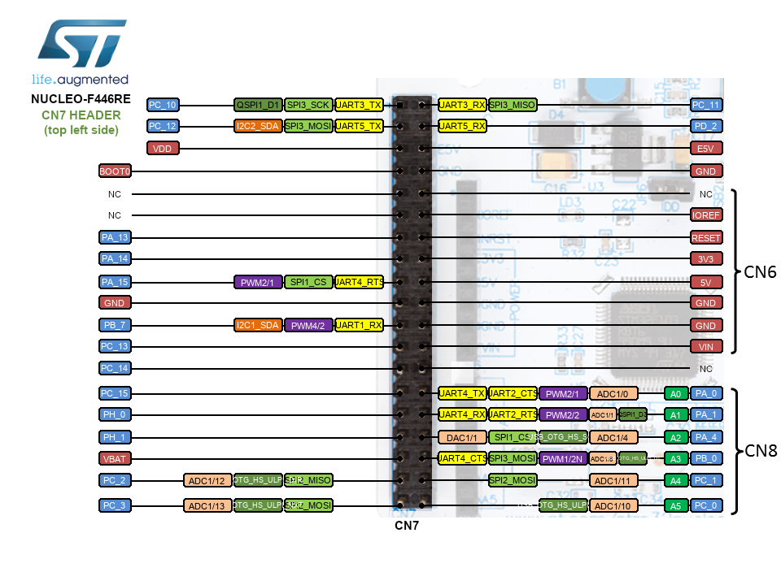
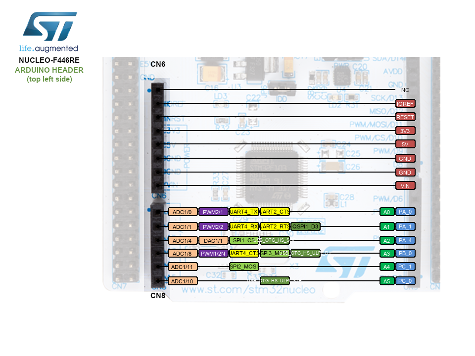
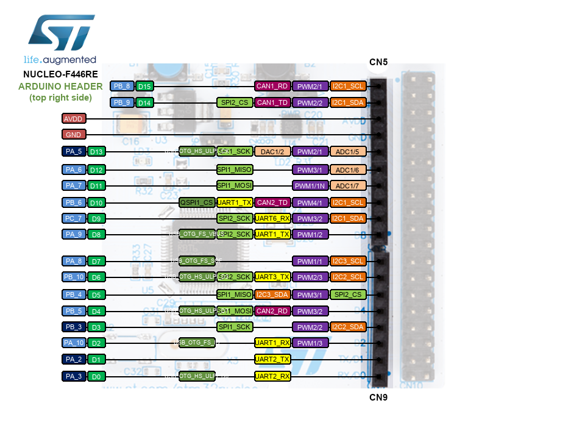
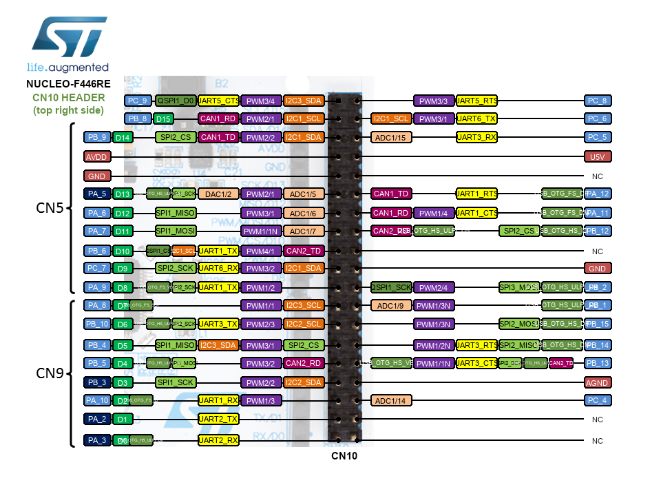

For this example we connect a LED in serie with a resistance and use the pin A8 as supply source.
