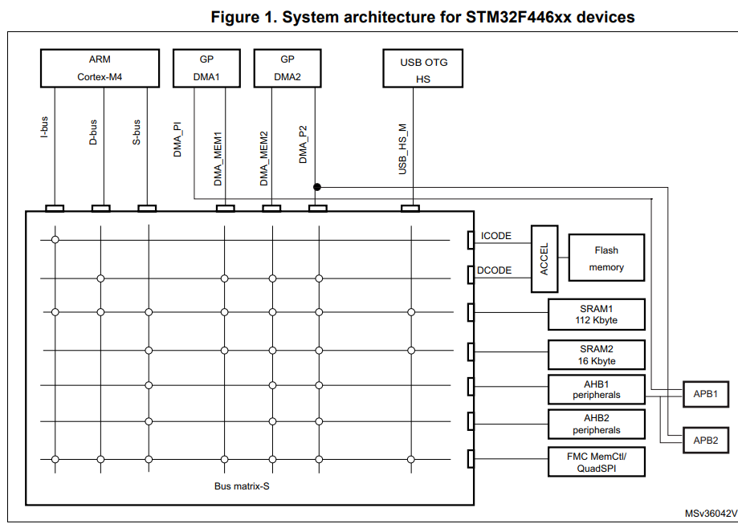
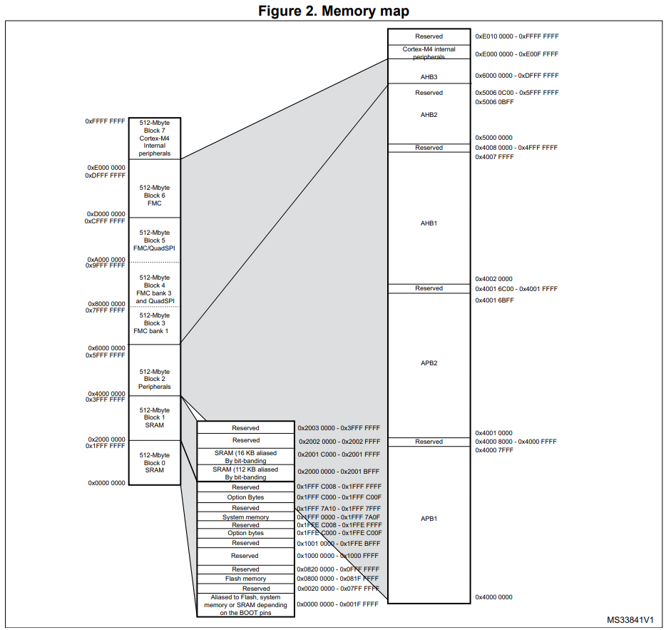

# Getting Started with STM32 ARM Cortex MCUs

Goals: 
- introduction to STM32 ARM-Cortex based microcontrollers
- The internal architecture, buses and features
- discuss the reset and clock control circuitry with the clock tree

[Link for the tutorial 01](https://deepbluembedded.com/getting-started-with-stm32-arm-cortex-mcus/)

## STM32 ARM - Based Microcontrollers 

The development board selected for this series of tutorials: Nucleo-F446RE

Here is the core highlight diagramm for the STM32F446RE microcontroller part.

+ **ARM Cortex-M4 Processor + FPU (Floating Point Unit)**
Properties:
  - reduced pin count 
  - low-power consumption, while delivering outstanding computational performance and an advanced response to interrupts.

+ **Adaptive Real-Time (ART) Accelerator**: is a memory accelerator that is optimized for STM32 industry-standard Arm Cortex M4 processors.

  - It balances the inherent performance advantage of the ARM Cortex-M4 with FPU over Flash memory technologies, which normally requires the processor to wait for the Flash memory at higher operating frequencies. To release the processor full performance, the accelerator mplements an instruction prefetch queue and branch cache which increases program execution speed from the 128- bit Flash memory. Based on CoreMark benchmark, the performance achieved thanks to the ART accelerator is equivalent to 0 wait state program execution from Flash memory at a CPU frequency up to 180 MHz

+ **Memory Protection Unit (MPU)**: it's used to manage the CPU accesses to memory to prevent one task to accidentally corrupt the memory or resources used by any other active task. This memory area is organized into up to 8 protected areas that can in turn be divided up to 8 subareas. The MPU is especially helpful for applications where some critical or certified code has to be proteceted against the misbehavior of others tasks.

+ **Firewall**: the device embeds a Firewall that protects code sensitive and secure data from any access performed by a code executed outside of the protected areas. Each illegal access generates a reset which kills immediately the detected intrusion. 

+ **Boot modes**:
In the STM32F446xx, three different boot modes can be selected through the BOOT[1:0] pins as shown in the following table: 

|Boot1  | Boot0 | Boot mode | Aliasing  |
|-------|-------|---------  |---------- |  
|   X   |  0    | Main Flash memory | Main Flash Memory is selected as the boot area |
|   0   |   1   | System Memory| System Memory is selected as the boot area |
|   1   |   1   | Embedded SRAM | Embedded SRAM is selected as the boot area|   

    A flash empty check mechanism is implemented to force the boot from system flash if the first flash memory location is not programmed and if the boot selection is configured to boot from the main flash. 

    The boot-loader is located in system memory. It is used to reprogramm the flash memory by using USART, I2C, SPI or USB FS in Device Mode through DFU ( Device Firmware upgrade)

## System Architecture and Bus Matrix 

The Bus matrix provides access from a master to a slave, enabling concurrent access and efficient option even when several high-speed peripherals work simultaneously. 

In STM32F446xx, the main system consists of 32 bit multilayer AHB bus matric that interconnects: 
* seven masters: 
    - Cortex -M4 with FPU core I-Bus, D-Bus and S-bus
    - DMA1 memory bus 
    - DMA2 memory bus
    - DMA2 peripheral bus
    - USB OTG HS DMA bus 

* Seven slaves: 
    - Internal Flash memory ICode bus
    - Internal Flash memory DCode bus
    - Main internal SRAM1 (112KB)
    - Auxiliary internal SRAM2 (16KB)
    - AHB1 peripherals including AHB to APB bridges and APB peripherals 
    - AHB2 peripherals
    - FMC / QUADSPI  

**BusMatrix**: manages the access arbritation between masters. The arbritation uses a round-robin algorithm.

**I-Bus**: connects the instruction bus of the Cortex-M4 with FPU core to the BusMatrix. This bus is used by the core to fetch instructions. The target of this bus is a memory containing code (internal Flash memory or external memories through the FMC)

**D-Bus**: connects the databus of the Cortex-M4 with FPU to the BusMatrix. This bus is used by the core for literal load and debug access. The target of this bus is memory containing code or data (internal flash memory or external memories though the FMC)

**S-Bus**: connects the system bus of the cortex-M4 with FPU code to a BusMatrix. This Bus is used to access data located in a peripeheral or in SRAM. Instructions may also be fetch on this bus (less efficient than ICode). The targets of this bus are the internal SRAM, SRAM2, the AHB2 peripherals including the APB peripherals and the external memories through the FMC and QUADSPI.

**DMA memory bus**: This bus connects the DMA memory bus master interface to the BusMatrix. It is used by the DMA to perfom transfer to/from memories. The targets of this bus are data memories: internal Flash, internal SRAMs (SRAM1, SRAM2) and external memories through the FMC and QUADSPI. 

**DMA peripheral bus**: This bus connnects the DMA peripheral master bus interface to the BusMatrix. This bus is used by the DMA to access AHB peripherals or to perform memory-to-memory transfers. The targets of the bus are the AHB and APB peripherals plus data memories: internal Flash, internal SRAMs (SRAM1, SRAM2) and external memories through the FMC and the QUADSPI. 

**AHB/APB Bus Bridges**: The two AHB/APB bridges provide full synchronous connections between the AHB and the two APB buses, allowing flexible selection of the peripheral frequency address mapping of the peripherals connected to this bridge.  

After each device reset, all peripheral clocks are disabled (except for the SRAM and Flash memory interface). 

    Note : Before using a peripheral you have to enable its clock in the RCC_AHBxENR or RCC_APBxENR register.

* **Memory Map**: Program memory, data memory, registers and I/O ports are organized within the same linear 4-Gbyte address space. 
    - The bytes are coded in memory in Little Endian Format. THe lowest numbered byte in a word is considered the word's least significat byte and the highest numbered byte the most significant. The addressable memory space is divided into eight main blocks, of 512 Mbytes each. 

### RCC and Clock Tree 
* A **Power Reset** is generated when one of the following events occcurs.
    - a Brown-out Reset (BOR)
    - when exiting from Standby mode
    - when exiting from Shutdown mode
* A **System Rest** sets all registers to the reset values unless specified otherwise in the register description. The reset source can be identified by checking the reset flags in the Control/Status register, RCC_CSR. A System reset is generated when one of the following events occurs: 
    - A low level on the NRST pin (external reset)
    - Window watchdog event (WWDG reset)
    - independent watchdog event (IWDG reset)
    - A firewall event (FIREWALL reset)
    - A software reset (SW reset)
    - Low-power mode security reset
    - Option byet loader reset 
    - A Brown-out reset

**Clock Tree**
Four different clock sources can be used to drive the system clock (SYSCLK): 
+ HSI16 (High speed internal) 16 MhZ RC oscillator clock
+ MSI (multispeed internal) RC oscillator clock
+ HSE oscillator clock, from 4 to 48 MHz 
+ PLL clock 

Each clock source can be switched on or off independently when it is not used, to optimize power consumption.